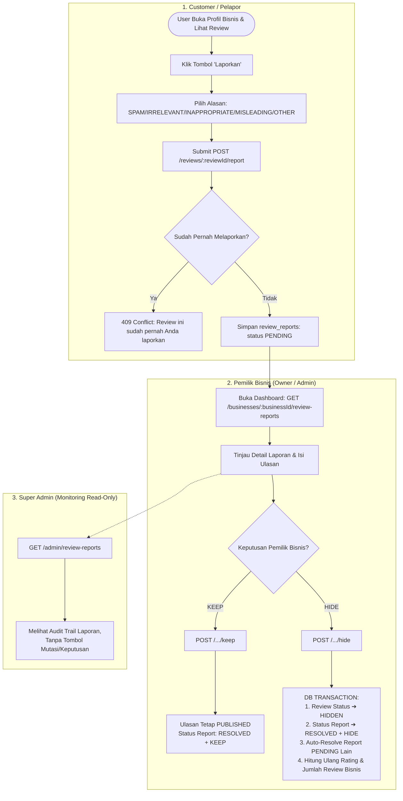

# Dokumentasi Flow & Endpoint Implementation: Report Review (Business-Led Moderation)

Dokumentasi ini menjelaskan alur sistem (*flowchart*), peranan 3 aktor pengguna, spesifikasi endpoint, struktur payload request/response lengkap, serta petunjuk praktis pengujian Postman secara berurutan untuk modul **Report Review (Business-Led Moderation)** pada platform **Katamereka.id**.

---

## 1. Flowchart System (Mermaid)



---

## 2. Peranan & Otorisasi 3 Aktor System

1. **User / Pelapor (Customer)**:
   - Melaporkan ulasan yang dianggap melanggar atau tidak sesuai.
   - Dibatasi hanya **1 kali laporan per ulasan** (*Unique Constraint*).
   - Dapat mengecek status laporan miliknya sendiri (`GET /reviews/:reviewId/report-status`).

2. **Pemilik Bisnis (Owner / Admin Bisnis)**:
   - Menjadi **Penentu Utama (*Business-Led Moderation*)** karena yang paling paham konteks layanan dan pelanggan mereka.
   - Mengambil keputusan **KEEP** (ulasan tetap tayang) atau **HIDE** (ulasan disembunyikan dari publik).
   - Saat ulasan di-HIDE, rating rata-rata (*average_rating*) dan jumlah ulasan (*review_count*) bisnis dihitung ulang secara otomatis dalam *database transaction*.

3. **Super Admin (Read-Only Audit)**:
   - **Hanya bertindak sebagai pemantau (*Monitoring Read-Only*)**.
   - Bebas melihat seluruh daftar laporan dan riwayat keputusan pemilik bisnis (`GET /admin/review-reports`), tetapi **TIDAK memiliki tombol/API untuk melakukan approve, reject, hide, atau delete**.

---

## 3. Rincian Endpoint & Payload Response Lengkap

### A. SISI USER / PELAPOR

#### Endpoint 1: Submit Laporan Ulasan
* **URL**: `POST /reviews/:reviewId/report`
* **Header**: `Authorization: Bearer <JWT_USER_TOKEN>`
* **Body Request**:
  ```json
  {
    "reason": "SPAM",
    "description": "Ulasan ini terlihat seperti iklan atau promosi spam berulang."
  }
  ```
* **Response 201 Created**:
  ```json
  {
    "success": true,
    "message": "Laporan berhasil dikirim"
  }
  ```
* **Response 409 Conflict (Duplicate Report)**:
  ```json
  {
    "success": false,
    "message": "Review ini sudah pernah Anda laporkan"
  }
  ```

#### Endpoint 2: Cek Status Laporan Saya Terhadap Ulasan
* **URL**: `GET /reviews/:reviewId/report-status`
* **Header**: `Authorization: Bearer <JWT_USER_TOKEN>`
* **Response 200 OK**:
  ```json
  {
    "reported": true,
    "status": "PENDING",
    "resolution": null
  }
  ```

---

### B. SISI BUSINESS DASHBOARD (OWNER / ADMIN)

#### Endpoint 3: Ringkasan Jumlah Laporan (Summary Card)
* **URL**: `GET /businesses/:businessId/review-reports/summary`
* **Header**: `Authorization: Bearer <JWT_OWNER_OR_ADMIN_TOKEN>`
* **Response 200 OK**:
  ```json
  {
    "pending": 3,
    "resolved": 12,
    "total": 15
  }
  ```

#### Endpoint 4: List Ulasan Dilaporkan (Dashboard Table)
* **URL**: `GET /businesses/:businessId/review-reports?status=PENDING&page=1&limit=20`
* **Header**: `Authorization: Bearer <JWT_OWNER_OR_ADMIN_TOKEN>`
* **Response 200 OK**:
  ```json
  {
    "data": [
      {
        "id": "e9876543-21ab-4321-90ef-123456789abc",
        "reason": "SPAM",
        "description": "Ulasan ini terlihat seperti iklan atau promosi spam berulang.",
        "status": "PENDING",
        "resolution": null,
        "created_at": "2026-09-28T14:00:00.000Z",
        "reviewed_at": null,
        "reviewed_by": null,
        "reviewer_name": null,
        "review": {
          "id": "a1b2c3d4-e5f6-7890-abcd-1234567890ab",
          "rating": 1,
          "title": "Jelek",
          "content": "Tempat jelek jangan datang kesini slot gacor www...",
          "status": "PUBLISHED",
          "created_at": "2026-09-27T10:00:00.000Z",
          "author": {
            "id": "u123",
            "name": "Budi Reviewer",
            "email": "budi@gmail.com"
          }
        },
        "reporter": {
          "id": "u456",
          "name": "Siti Pelapor",
          "email": "siti@gmail.com"
        }
      }
    ],
    "pagination": {
      "page": 1,
      "limit": 20,
      "total": 1,
      "total_pages": 1
    }
  }
  ```

#### Endpoint 5: Detail Laporan Ulasan
* **URL**: `GET /businesses/:businessId/review-reports/:reportId`
* **Header**: `Authorization: Bearer <JWT_OWNER_OR_ADMIN_TOKEN>`

#### Endpoint 6: Tindakan KEEP (Ulasan Tetap Tayang)
* **URL**: `POST /businesses/:businessId/review-reports/:reportId/keep`
* **Header**: `Authorization: Bearer <JWT_OWNER_OR_ADMIN_TOKEN>`
* **Response 200 OK**:
  ```json
  {
    "success": true,
    "message": "Laporan diproses: Ulasan tetap ditayangkan (KEEP)",
    "data": {
      "report_id": "e9876543-21ab-4321-90ef-123456789abc",
      "status": "RESOLVED",
      "resolution": "KEEP"
    }
  }
  ```

#### Endpoint 7: Tindakan HIDE (Sembunyikan Ulasan & Hitung Ulang Rating)
* **URL**: `POST /businesses/:businessId/review-reports/:reportId/hide`
* **Header**: `Authorization: Bearer <JWT_OWNER_OR_ADMIN_TOKEN>`
* **Response 200 OK**:
  ```json
  {
    "success": true,
    "message": "Laporan diproses: Ulasan berhasil disembunyikan (HIDE) dan rating dihitung ulang",
    "data": {
      "report_id": "e9876543-21ab-4321-90ef-123456789abc",
      "review_id": "a1b2c3d4-e5f6-7890-abcd-1234567890ab",
      "review_status": "HIDDEN",
      "status": "RESOLVED",
      "resolution": "HIDE",
      "new_average_rating": 4.8,
      "new_review_count": 24
    }
  }
  ```

---

### C. SISI SUPER ADMIN (READ-ONLY AUDIT)

#### Endpoint 8: List All Reports (Super Admin Monitoring)
* **URL**: `GET /admin/review-reports?page=1&limit=20`
* **Header**: `Authorization: Bearer <SUPER_ADMIN_JWT_TOKEN>`

#### Endpoint 9: Detail Report (Super Admin Monitoring)
* **URL**: `GET /admin/review-reports/:id`
* **Header**: `Authorization: Bearer <SUPER_ADMIN_JWT_TOKEN>`

---

## 4. Urutan Langkah Praktek Pengujian di Postman

Lakukan secara berurutan sesuai alur bisnis:

1. **Langkah 1: Customer Melaporkan Ulasan**
   - User Login ➔ `POST /reviews/:reviewId/report` dengan body `{"reason": "SPAM"}`.
   - Cek status laporan user via `GET /reviews/:reviewId/report-status`.

2. **Langkah 2: Pemilik Bisnis Buka Dashboard**
   - Owner Login ➔ `GET /businesses/:businessId/review-reports/summary` (Lihat kartu laporan baru).
   - `GET /businesses/:businessId/review-reports?status=PENDING` (Lihat daftar laporan).

3. **Langkah 3: Pemilik Bisnis Menindak Laporan**
   - Pilih `POST /businesses/:businessId/review-reports/:reportId/hide` untuk menyembunyikan ulasan spam.
   - Verifikasi bahwa rating bisnis otomatis dihitung ulang.

4. **Langkah 4: Super Admin Monitoring**
   - Super Admin Login ➔ `GET /admin/review-reports` untuk melihat laporan yang telah diproses oleh pemilik bisnis.
