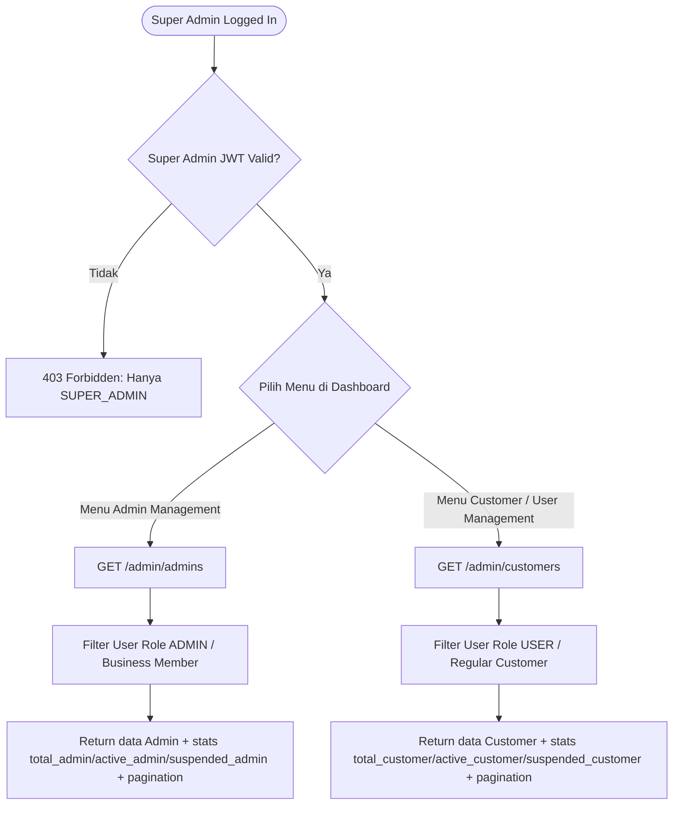

# Dokumentasi Flow & Endpoint Implementation: Super Admin (Admin & Customer Management)

Dokumentasi ini menjelaskan secara rinci alur bisnis, pemisahan dua endpoint utama Super Admin (`/admin/admins` & `/admin/customers`), spesifikasi payload request/response dengan format standar `data`, `stats`, dan `pagination`, serta petunjuk pengujian di Postman.

---

## 1. Hubungan Tugas (Jawaban Pertanyaan)

> **Apakah tugas ini ada hubungannya dengan yang tadi atau terpisah?**

**SANGAT BERHUBUNGAN SEBAGAI SATU KESATUAN MODUL SUPER ADMIN!**
* **Yang Pertama (`/admin/admins`)**: Mengelola data **Admin Bisnis / Owner Bisnis** (user yang mendaftar atau mengklaim bisnis).
* **Yang Kedua (`/admin/customers`)**: Mengelola data **Customer Biasa** (user publik yang hanya mendaftar sebagai reviewer/pengunjung platform).

Kedua endpoint dipisahkan secara rapi di Backend sesuai standar REST API:
1. `GET /admin/admins`
2. `GET /admin/customers`

---

## 2. Flowchart System (Mermaid)



---

## 3. Spesifikasi Endpoint & Payload Response

### Endpoint A: List & Stats Admin Bisnis (`/admin/admins`)
* **URL**: `GET /admin/admins`
* **Header**: `Authorization: Bearer <SUPER_ADMIN_JWT_TOKEN>`
* **Query Params**: `page`, `limit`, `search`, `status`, `startDate`, `endDate`

#### Response (200 OK):
```json
{
  "data": [
    {
      "id": "f8a9e210-4c31-4a11-b223-90d12e8412ab",
      "name": "Andi Pratama",
      "email": "andi@transgo.id",
      "role": "Admin Bisnis",
      "business_count": 2,
      "status": "ACTIVE",
      "last_login_at": "2026-09-21T08:12:00.000Z",
      "created_at": "2023-02-10T00:00:00.000Z"
    }
  ],
  "stats": {
    "total_admin": 8,
    "active_admin": 5,
    "suspended_admin": 2
  },
  "pagination": {
    "page": 1,
    "limit": 10,
    "total": 8,
    "total_pages": 1
  }
}
```

---

### Endpoint B: List & Stats Customer Biasa (`/admin/customers`)
* **URL**: `GET /admin/customers`
* **Header**: `Authorization: Bearer <SUPER_ADMIN_JWT_TOKEN>`
* **Query Params**: `page`, `limit`, `search`, `status`, `startDate`, `endDate`

#### Response (200 OK):
```json
{
  "data": [
    {
      "id": "c12d4567-89ab-4321-90ef-123456789abc",
      "name": "Siti Rahma",
      "email": "siti.rahma@gmail.com",
      "role": "Customer",
      "status": "ACTIVE",
      "last_login_at": "2026-09-28T11:00:00.000Z",
      "created_at": "2026-08-15T10:30:00.000Z"
    }
  ],
  "stats": {
    "total_customer": 120,
    "active_customer": 115,
    "suspended_customer": 5
  },
  "pagination": {
    "page": 1,
    "limit": 10,
    "total": 120,
    "total_pages": 12
  }
}
```

---

### Endpoint C: Management Aksi (Post / Status / Delete)
* **Tambah Admin**: `POST /admin/admins`
* **Ubah Status Admin**: `PATCH /admin/admins/:id/status` (Body: `{"status": "SUSPENDED"}`)
* **Hapus Admin**: `DELETE /admin/admins/:id`
* **Ubah Status Customer**: `PATCH /admin/customers/:id/status` (Body: `{"status": "SUSPENDED"}`)
* **Hapus Customer**: `DELETE /admin/customers/:id`

---

## 4. Langkah Pengujian di Postman untuk Abyaz / QA

1. **Login Super Admin**:
   * `POST http://localhost:3000/auth/login`
   * Body: `{"email": "admin@katamereka.id", "password": "Admin123!"}`
   * Copy `accessToken`.
2. **Uji List Admin Bisnis**:
   * `GET http://localhost:3000/admin/admins` dengan Auth `Bearer <accessToken>`.
3. **Uji List Customer**:
   * `GET http://localhost:3000/admin/customers` dengan Auth `Bearer <accessToken>`.
